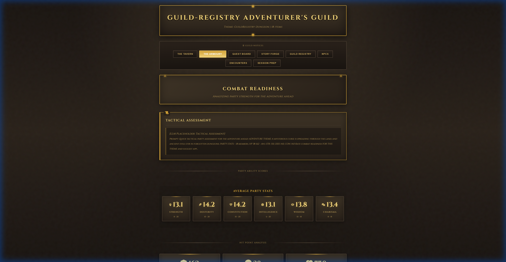

# BobReview

**Plugin based report generation framework**


## Overview

BobReview generates HTML reports from data. Core handles plugin loading, template rendering, and LLM calls. Plugins handle everything else: parsing, analysis, templates, themes, charts.

```
CORE                              PLUGINS
├── Plugin loader                 ├── Data parsers
├── Template engine (Jinja2)      ├── Report systems
├── LLM providers                 ├── Templates & themes
└── Registry                      ├── Charts & widgets
                                  └── generate_report()
```

The scaffolder creates working plugins. Run `bobreview plugins create my-plugin` to get parsers, templates, themes, and sample data.

## Quick Start

```bash
# Install
git clone https://github.com/DiggingNebula8/bobreview.git
cd bobreview
pip install .

# Create plugin
bobreview plugins create my-analytics

# Generate report (with LLM)
export OPENAI_API_KEY=sk-your-key
bobreview --plugin my-analytics --dir ~/.bobreview/plugins/my_analytics/sample_data

# Generate report (without LLM)
bobreview --plugin my-analytics --dir ~/.bobreview/plugins/my_analytics/sample_data --dry-run
```

## CLI

### Report Generation
```bash
bobreview --plugin <name> --dir <data>
bobreview --plugin <name> --dir ./data --output out.html
bobreview --plugin <name> --dir ./data --dry-run
```

### Plugin Management
```bash
bobreview plugins create <name>
bobreview plugins create <name> -o ./custom-dir
bobreview plugins list
bobreview plugins info <name>
```

### LLM Options
```bash
--llm-provider openai|anthropic|ollama
--llm-model gpt-4o
--llm-api-key sk-...
```

### Other
```bash
bobreview --list-plugins
bobreview --list-providers
bobreview doctor
```

## Core Structure

```
bobreview/
├── cli.py
├── core/
│   ├── plugin_system/
│   │   ├── loader.py
│   │   ├── registry.py
│   │   ├── plugin_helper.py
│   │   ├── discovery.py
│   │   └── scaffolder/
│   ├── template_engine.py
│   ├── config.py
│   └── html_utils.py
├── engine/
│   ├── loader.py
│   └── schema.py
└── services/
    ├── container.py
    ├── data_service.py
    └── llm/
```

## Plugin Discovery

Plugins load from these locations (in order):

1. `--plugin-dir <path>` CLI argument
2. `$BOBREVIEW_PLUGIN_DIRS` environment variable
3. `~/.bobreview/config.yaml` registered directories
4. `~/.bobreview/plugins/`
5. `./plugins/`

Using `bobreview plugins create -o <folder>` auto registers the folder.

## Scaffolded Plugin Contents

The scaffolder creates a working demo plugin with D&D-themed sample data:

| File | Purpose |
|------|---------|
| `manifest.json` | Metadata |
| `plugin.py` | Registration |
| `executor.py` | Report generation |
| `parsers/csv_parser.py` | Data parsing |
| `chart_generator.py` | Charts |
| `theme.py` | 5 themes (Dungeon, Midnight, Aurora, Sunset, Frost) |
| `templates/` | Jinja2 templates |
| `report_systems/*.json` | Pipeline config |
| `sample_data/sample.csv` | D&D character roster |

### Scaffolder Demo

The generated plugin creates a Guild Registry report with character stats, ability scores, and party analysis:




## Documentation

| Document | Description |
|----------|-------------|
| [QUICKSTART.md](QUICKSTART.md) | Getting started |
| [CHANGELOG.md](CHANGELOG.md) | Version history |
| [docs/PLUGIN_DEVELOPMENT_GUIDE.md](docs/PLUGIN_DEVELOPMENT_GUIDE.md) | Plugin development |

## Troubleshooting

**Plugin not found**: Run `bobreview plugins list` to check available plugins.

**No API key**: Set `OPENAI_API_KEY` env var, pass `--llm-api-key`, or use `--no-recommendations`.

## License

MIT License — see [LICENSE](LICENSE) for details.
